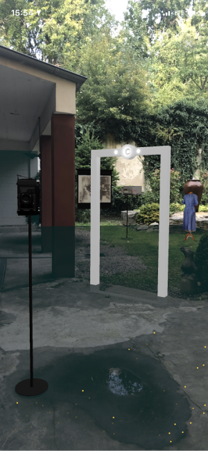

# Portal Editor Benutzung

Der Portal Editor ist eine Companion-App für Object by Object, mit der die persistenten WorldMaps für das Spiel erstellt und getestet werden können.

## Tourenübersicht

Im Portal Editor findet man zuerst eine Übersicht über die bereits erstellten Touren. Dazu gibt es eine Karten- sowie eine Listenübersicht, in der alle erstellten Portale aufgelistet sind.

 

## Portal Details

Auf der Portalseite befinden sich alle relevanten Informationen zum ausgewählten Portal. Dazu gehören die genaue Position des Portals auf Basis der Koordinaten (3.1), im CMS hinterlegte Bemerkungen (3.2) sowie alle im CMS und lokal gespeicherten WorldMaps (3.3, 3.4).

Über den "+"-Button (3.5) lässt sich eine ganz neue WorldMap erstellen.
Über "Start Ad-Hoc-Session"-Button (3.6) startet eine AR-Session ohne WorldMap. Dies ist nützlich, um einen schnellen ersten Blick auf die im Portal hinterlegten Objekte zu bekommen.

## Auswahl einer WorldMap

Nach Auswahl einer WorldMap werden alle Optionen zur Arbeit mit der WorldMap aufgelistet.

 

Dazu gehören zuerst die Session-Einstellungen:
* "Show Debugging Options" (4.1) startet die AR-Session in einem Debugging-Modus, bei dem alle in der Session erkannten Flächen und Punktwolken visualisiert werden. So wird der Fortschritt des aktuellen Scanning-Prozesses sowie der genaue Inhalt einer gerade geladenen bzw. erstellten WorldMap transparent gemacht. Der maskierende Effekt des Portals wird dabei entfernt.

* "Set Alignment" (4.2) definiert welche Flächen beim Scannen für die Erstellung der WorldMap berücksichtigt werden sollen:
  * Hori: Nur horizontale Oberflächen werden erkannt
  * Verti: Nur vertikale Oberflächen werden erkannt
  * Both: Horizontale und vertikale Oberflächen werden erkannt
  * None: (In der Praxis werden auch hier horizontale und vertikale Oberflächen erkannt. Soll diese Option aus der App entfernt werden?)

Unter den Session-Einstellungen befinden sich die Optionen zur Arbeit mit der ausgewählten WorldMap:
* "Play Session" (4.3) lädt die aktuelle Version der WorldMap und verändert diese nicht
* "Create New Session"/"Edit Session" (4.4) startet eine AR-Session mit der aktuellen Version der ausgewählten WorldMap und reichert diese während der Session mit weiteren Informationen an
* "Create Local Copy" (4.5) dupliziert die aktuelle Version der WorldMap und speichert diese lokal ab

Das im CMS hinzugefügte Hinweis-Bild kann über den "Hinweis-Bild"-Button (4.6) am unteren Bildschirmrand angezeigt werden.

Ist eine WorldMap in einem zufriendenstellenden Zustand, so kann diese über den Export-Button (4.7) exportiert werden.

## AR-Session

 

Sobald die AR-Session startet, wird die ausgewählte WorldMap im Hintergrund geladen und der Scanning-Prozess beginnt. Während des Scannens werden die Topologie und Oberflächenbeschaffenheit der Umgebung analysiert und diese Daten mit den in der WorldMap abgespeicherten Daten abgeglichen. Gibt es eine hinreichende Übereinstimmung, so werden die 3D-Objekte an den in der WorldMap gespeicherten Orten im Raum positioniert.

Eine WorldMap enthält eine Reihe an Daten. Zu den Datenpunkten einer WorldMap gehören:
- Erkannte horizontale und vertikale Flächen
- Punkte auf Oberflächen im Raum (inkl. deren Farbe)
- Objekt-Anker, die für die Positionierung von Objekten benutzt werden

Im Debugging-Modus werden die projezierten Flächen und Punkte visualisiert.

Während des Scanning-Prozesses werden die Oberflächen der Umgebung analysiert und die Ergebnisse mit den in der WorldMap gespeicherten Daten abgeglichen. Sobald es eine Übereinstimmung gibt, werden die in der WorldMap referenzierten 3D-Objekte im Raum positioniert.

Wenn die Session mit einer neuen WorldMap ohne gespeicherte Flächen und Objekt-Anker startet, dann wird das Portal mittig auf der zuerst gefundenen Fläche positioniert. Die Objekte werden in einem Halbkreis um das Portal herum positioniert. Da zu diesem Zeitpunkt keine Informatioenn über die Topologie des Raumes außerhalb dieser ersten Fläche vorliegen, kann es sein, dass Objekte innerhalb von räumlichen Hindernissen positioniert werden. Eine Umpositionierung ist aber kein Problem.

Sobald die Objekte im Raum positioniert sind, kann dann die Szene eingerichtet werden. Die Position und Rotation aller Objekte kann durch die folgenden Interaktionen beliebig angepasst werden:
- Durch die Auswahl des Objektes mit einem Finger und eine anschließende Drag-Bewegung oder die anschließende Bewegung des Gerätes, kann die Position des Objektes angepasst werden
- Die Rotation wird durch eine Auswahl mit  zwei Fingern und anschließende Rotation dieser verändert werden

Standardmäßig ist während der Session der Auto-Save-Modus ausgeschaltet. Die Daten der ausgewählten WorldMap werden dann nicht automatisch mit den Daten der aktuellen Session angereichert. Stattdessen findet das Speichern entweder durch Auswahl des "Save"-Buttons (5.2) oder durch die Bestätigung des Speicherns beim Beenden der Session statt. Über den Auto-Save-Toggle (5.1) kann ein automatisches Speichern aktiviert werden.

Am unteren Bildschirmrand (5.3) werden Performance-Statistiken zur aktuellen Session dargestellt. Ist die Performance einer Session nicht optimal, d.h. die Bildschirmrate fällt unter 30 FPS, sollten Maßnahmen zur Verbesserung der Performance ergriffen werden. Eine vollständige Auflistung der Optionen gibt es [ HIER!!!! ].

## Erstellung einer WorldMap

## Performance-Optimierung

- Anzahl der Objekte reduzieren
- Dateigröße von genutzten 3D-Objekten, Fotos und Videos reduzieren

### Arbeit mit einer bestehenden WorldMaps

WorldMaps sind die Grundlage einer persistenten AR-Experience. Dabei sind das Portal und alle enthaltenen Objekte für jede User*in tatsächlich am räumlich identischen Ort positioniert. Die WorldMap sorgt für diese übereinstimmende Positionierung. Dazu enthält die WorldMap Informationen über die Umgebung wie die Positionierung und Größe horizontaler und vertikaler Flächen, Punktwolken, sowie die Farbgebung der darunter liegenden Oberflächen. Spielt die User*in das Spiel und möchte ein Portal öffnen, werden die beim Scannen gesammelten Informationen mit den in der WorldMap gespeicherten Informationen kontinuierlich abgeglichen. Sobald es beim Abgleich der Informationen eine ausreichende Übereinstimmung gibt, wird die WorldMap geladen und die 3D-Objekte entsprechend im Raum positioniert.

## Einstiegspunkte in die Session

Bei der Erstellung einer WorldMap ist es wichtig einen markanten Einstiegspunkt für die Session zu wählen. Dieser Einstiegspunkt zeichnet sich entweder durch eine markante Topologie oder/und eine markante Oberflächenbeschaffenheit aus. Um sicherzugehen, dass dieser Einstiegspunkt auch in der WorldMap entsprechend gespeichert wird, sollte die Session mit dem Scannen dieses Punktes gestartet werden. Ob der Einstiegspunkt funktioniert, kann am Einfachsten getestet werden, indem die Session über "Play Session" direkt gespielt wird. Um eine WorldMap flexibler und für die User*in im Spiel einfacher zu erkennen zu machen, macht es Sinn mehrere Einstiegspunkte in die WorldMap zu integrieren. Dazu beginnt man den erneuten Scanning-Prozess am zusätzlich gewählten Einstiegspunkt und bewegt sich dann zum bereits zuvor angelegten Einstiegspunkt vor. Wird die WorldMap dann am alten Einstiegspunkt erkannt und geladen, befinden sich beide Einstiegspunkte in der WorldMap. Weitere Einstiegspunkte können nach dem gleichen Ablauf hinzugefügt werden. Ab einer bestimmten Größe der WorldMap werden vorherige Einstiegspunkte aber wieder überschrieben. Eine genaue Regel dazu gibt es nicht. Die Funktionsweise der WorldMaps muss daher kontinuierlich getestet werden.

Charakteristiken guter Einstiegspunkte:
* Markante Topologie
* Kontrastreiche Oberflächenbeschaffenheit

Charakteristiken schlechter Einstiegspunkte:
* Kontrastreiche Oberflächen, die vergänglich sind (z.B. Graffiti)

Da beim Scannen nicht nur die Topologie der Umgebung, sondern auch die Farblichkeit dessen analysiert wird, sind dem Erkennen gespeicherter WorldMaps gewisse Grenzen gesetzt. Je stärker sich die Farbigkeit einer Oberfläche im Vergleich zum Original-Scan verändert hat, desto wahrscheinlicher wird es, dass die WorldMap nicht erkannt wird. Besondere Faktoren, auf die es dabei zu achten gilt, sind die Folgenden:
* Kontrastreiche Schatten durch direkte Sonneneinstrahlung
* Verdunkelte Oberflächen durch Nässe

Bei der Erstellung von WorldMaps sollte daher darauf geachtet werden, dass die gescannte Umgebung möglichst wenig von kontrastreichen Schatten durch direkte Sonneneinstrahlung betroffen ist und dass die Oberflächen beim Scannen in einem trockenen Zustand sind.

## Export von WorldMaps

## Wie WorldMaps funktionieren

Mit Hilfe

## Was bei der Erstellung von WorldMaps zu beachten ist
